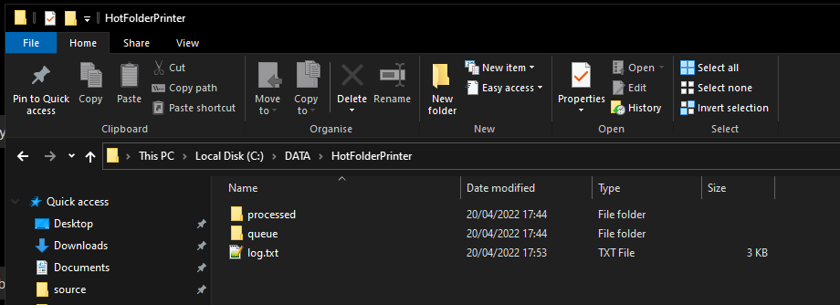
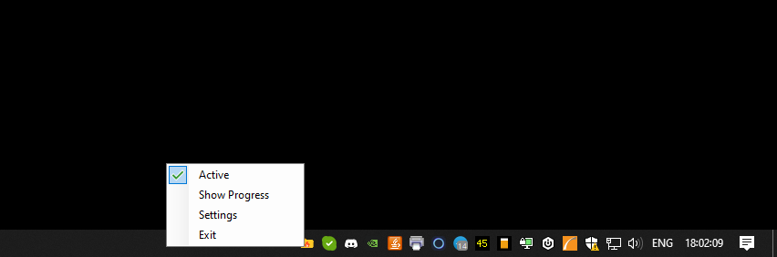
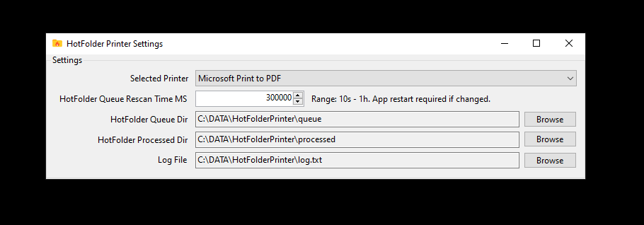

# HotFolderPrinter project

An example project using `RawPrint` to prind pdf files from a folder.  
HotFolderPrinterSetup project creates MSI installer. `%appdata%\HotFolderPrinter\HotFolderPrinter`  

## How does it work

* Periodically scans a folder with Timer
* Looks for PDF files `"*.pdf"` in `queueDir`
* Iterates on this list of pdf files, then creates a print job using `RawPrint`
* Moves the printed pdf files to `processedDir`
* Write logs

## Usage

* Try with `Microsoft Print to PDF` printer first. Default output location is your `Documents` folder.
* Make sure you configure your default printer settings first. For example using only grayscale colors, paper size, etc.

## Screenshots

  
  
  
